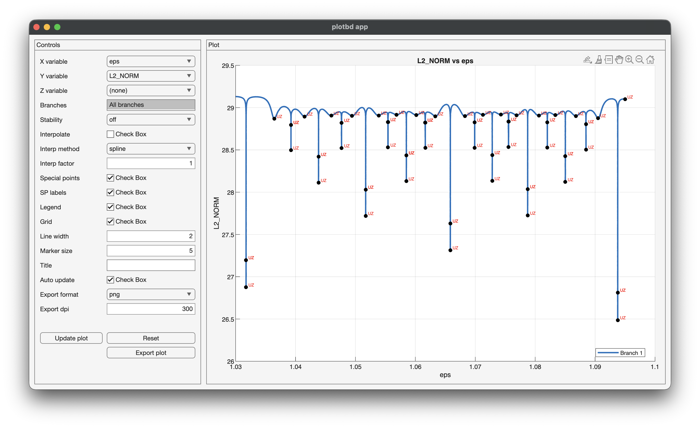

# MAUTOLAB

MAUTOLAB is a MATLAB toolkit for reading and working with output files produced by [AUTO-07p](https://sourceforge.net/projects/auto-07p/). The long-term goal is to provide a clean MATLAB interface for AUTO output files such as `b.*`, `d.*`, and `s.*`.

At the current stage, the toolkit includes:
- a reader for **AUTO bifurcation diagram files** (`b.*`)
- utilities for **visualising and exploring bifurcation data**

Tested in **MATLAB R2025a**.

---

## Current functionality

### `read_b_auto`

`read_b_auto` reads an AUTO `b.*` file and returns a MATLAB struct array, with one entry per branch.

Each branch contains:

- `branch_number`: the AUTO branch number
- `data`: a MATLAB table with the numerical columns for that branch
- `header`: a struct containing parsed metadata from the branch header

---

### `parse_header_lines`

This helper function parses metadata lines that appear in the header block of each branch in a `b.*` file.

Supported metadata currently includes:

- standard numeric AUTO constants such as `NDIM`, `IPS`, `NTST`, `DS`, etc.
- lowercase string fields such as `e`, `s`, `dat`, `sv`
- `User-specified parameters:` written either as numeric indices or as symbolic names
- `Active continuation parameters:` written either as numeric indices or as symbolic names
- indexed name maps such as
  - `parnames = {1: 'rho', 2: 'beta', 3: 'sigma'}`
  - `unames   = {1: 'x', 2: 'y', 3: 'z'}`

---

### `plotbd`

`plotbd` is the main plotting function for AUTO bifurcation diagrams.

It supports both **2D and 3D plotting**, with a flexible interface:

```matlab
plotbd(branches)                          % default (columns 4 vs 5)
plotbd(branches, 'x', 4, 'y', 5)          % explicit columns
plotbd(branches, 'x', 'PAR_1', 'y', 'L2_NORM')
plotbd(branches, 'x', 4, 'y', 5, 'z', 6)  % 3D plot
```

#### Features

- automatic defaults based on column positions (4 and 5)
- support for both **column indices** and **variable names**
- optional **3D plotting** via `'z'`
- branch selection (`'branches', [1 2 5]` or `'all'`)
- stability visualisation (`'off'`, `'dashed'`, `'pale'`)
- interpolation of curves
- special point detection and labelling
- full control over line width, markers, legend, and grid

---

### `showbdvars`

`showbdvars` helps inspect the variables available in the loaded data.

```matlab
showbdvars(branches)
showbdvars(branches, [1 2])
```

This prints the variable names available in each selected branch, making it easier to choose what to plot.

---

### `plotbd_app`

`plotbd_app` launches an **interactive GUI** for exploring bifurcation diagrams.

```matlab
plotbd_app(branches)
```

#### Features

- interactive selection of:
  - x, y, z variables
  - branch subsets
  - stability display mode
  - interpolation settings
  - special points and labels
- automatic switching between **2D and 3D**
- live updating of the plot
- export plots to file (PNG, JPG, PDF, FIG)
- fully built on top of `plotbd` (consistent behaviour)

---

## App preview



---

## Files in this repository

- `read_b_auto.m` — main reader for AUTO `b.*` files
- `parse_header_lines.m` — helper for parsing header metadata
- `plotbd.m` — main plotting function (2D/3D)
- `showbdvars.m` — helper to inspect available variables
- `plotbd_app.m` — interactive GUI for exploration

---

## Basic usage

Place the `.m` files on your MATLAB path, then run:

```matlab
branches = read_b_auto("b.lor");
```

Inspect the data:

```matlab
branches(1).branch_number
branches(1).header
branches(1).data(1:5,:)
```

Plot a bifurcation diagram:

```matlab
plotbd(branches)
```

Launch the interactive app:

```matlab
plotbd_app(branches)
```

---

## Output format

For a file with several branches, the output has the form:

```matlab
branches(k).branch_number
branches(k).header
branches(k).data
```

where `branches(k).data` is a MATLAB table.

The first numerical column in the AUTO `b.*` file is the signed branch number. This column is **not** duplicated in the output table; instead it is stored as `branch_number`.

---

## Notes on column names

The reader converts AUTO column labels into MATLAB-safe table variable names. For example:

- `PAR(1)` → `PAR_1`
- `MAX U(1)` → `MAX_U_1`
- `L2-NORM` → `L2_NORM`

This makes the columns easy to access in MATLAB code.

---

## Example

```matlab
branches = read_b_auto("b.het");
T = branches(1).data;

plot(T.PAR_1, T.MAX_U_1)
```

---

## Current limitations

This repository is currently focused on `b.*` files only.

Planned future extensions include:

- `s.*` solution files
- `d.*` diagnostics files

There is also room for additional utilities, for example:

- branch filtering and selection
- higher-level plotting presets
- tools for analysing special points and bifurcations
- integration with continuation workflows