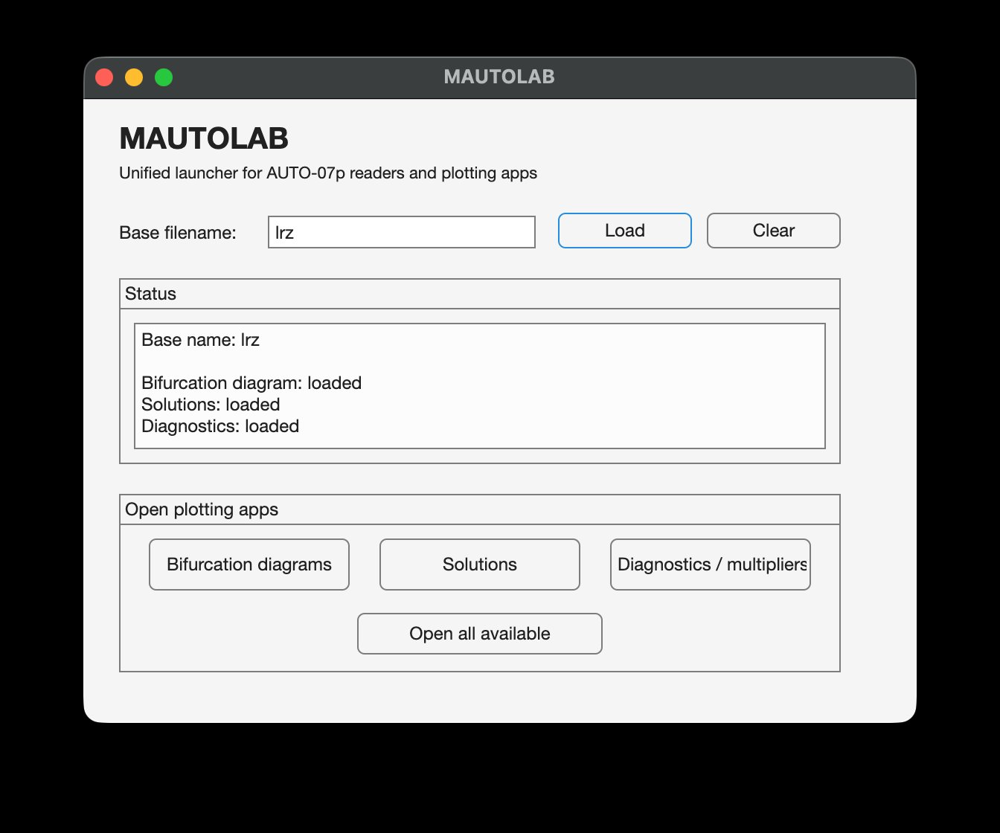
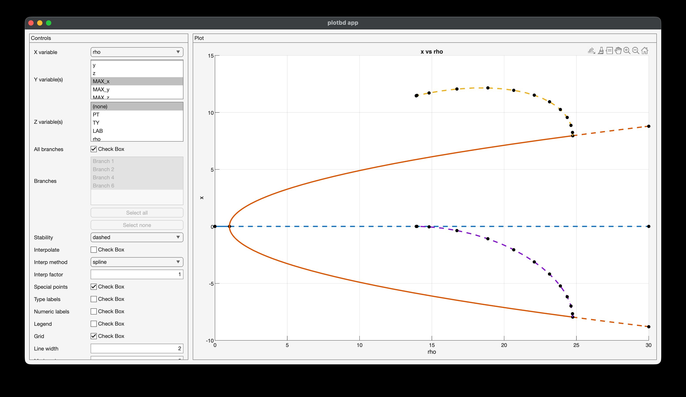
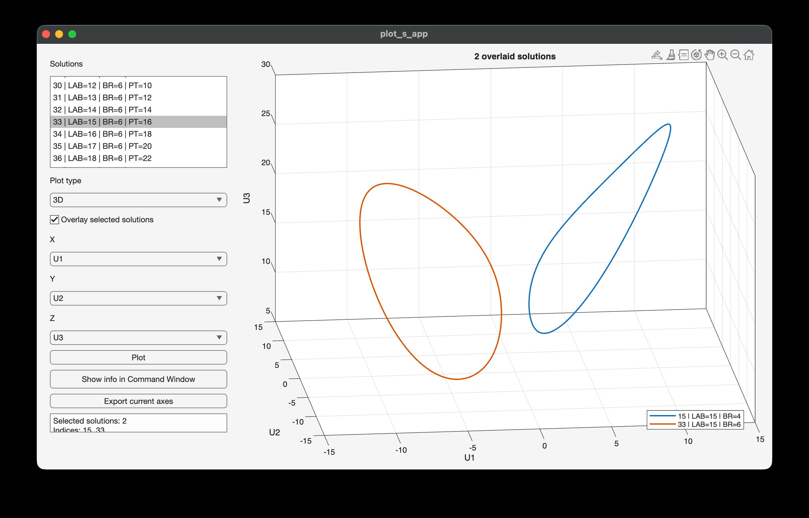
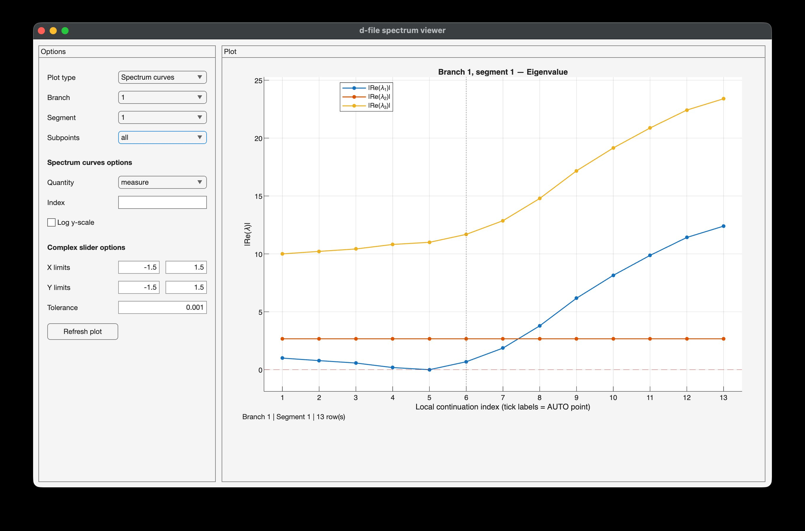
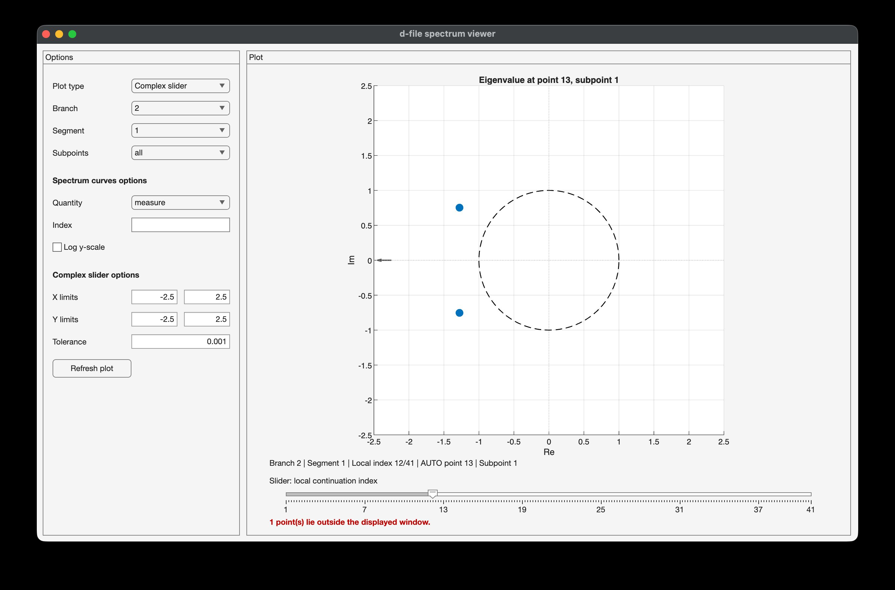

# MAUTOLAB

MAUTOLAB is a MATLAB toolkit for reading, parsing, and visualising output files produced by [AUTO-07p](https://github.com/auto-07p/auto-07p) — a widely-used software package for numerical bifurcation analysis and continuation of dynamical systems.

AUTO produces three types of output files per run:

| File | Content |
|------|---------|
| `b.*` | Bifurcation diagram — one row per continuation step |
| `d.*` | Diagnostics — eigenvalues or Floquet multipliers at each step |
| `s.*` | Solutions — full state trajectories at labelled points |

MAUTOLAB provides a clean, structured, MATLAB-native interface to all three, with both a programmatic API and interactive GUI apps.

**Tested in MATLAB R2025a.**

---

## Installation

1. Clone or download this repository.
2. Add the root folder to your MATLAB path:

```matlab
addpath('/path/to/MAUTOLAB')
```

No toolboxes beyond core MATLAB are required.

---

## Quick start

```matlab
% Load all three files at once
data = MAUTOLAB('lrz');

% Plot the bifurcation diagram
plotbd(data.bif_diagram);

% Print a diagnostic summary
d_summary(data.diagnostics);

% Browse solutions interactively
plot_s_app(data.solutions);
```

---

## Worked example — Lorenz system

The `examples/` folder contains a complete worked example based on AUTO output for the Lorenz equations:

```
dx/dt = sigma*(y - x)
dy/dt = x*(rho - z) - y
dz/dt = x*y - beta*z
```

with `sigma = 10`, `beta = 8/3` (fixed) and `rho` as the continuation parameter.

The run tracks:
- **Branch 1** — the trivial equilibrium at the origin (`rho` from 0 to 30). A transcritical bifurcation (BP) is detected at `rho = 1`.
- **Branch 2** — the two symmetric non-trivial equilibria C+/C−. A Hopf bifurcation is detected at `rho ≈ 24.74`.
- **Branches from label 4 onward** — periodic orbits born at the Hopf point, continued in `rho`.

To run the example, copy `b.lrz`, `d.lrz`, `s.lrz` from `examples/` to your working directory and then run:

```matlab
run('examples/example_lorenz.m')
```

---

## Repository structure

```
MAUTOLAB/
│
├── MAUTOLAB.m            % unified reader — entry point
├── MAUTOLAB_app.m        % unified GUI launcher
│
├── b_files/              % bifurcation diagram tools
│   ├── read_b_auto.m
│   ├── parse_header_lines.m
│   ├── plotbd.m
│   ├── showbdvars.m
│   └── plotbd_app.m
│
├── d_files/              % diagnostics tools
│   ├── read_d_auto.m
│   ├── read_d_blocks.m
│   ├── read_d_table.m
│   ├── d_summary.m
│   ├── d_plot_spectrum.m
│   ├── plot_complex_slider.m
│   ├── get_multipliers.m
│   └── d_plot_app.m
│
├── s_files/              % solution tools
│   ├── read_s_auto.m
│   ├── plot_s_auto.m
│   ├── show_s_vars.m
│   └── plot_s_app.m
│
├── examples/
│   ├── example_lorenz.m  % worked example script
│   ├── b.lrz
│   ├── d.lrz
│   └── s.lrz
│
└── docs/
```

---

## Graphical interface

MAUTOLAB ships four interactive apps. For most users these are the fastest way to explore results — no scripting required.

---

### `MAUTOLAB_app` — unified launcher

The recommended entry point. Type in the MATLAB Command Window:

```matlab
MAUTOLAB_app
```



**What it does:**
1. Enter a base filename (e.g. `lrz`) in the text field and click **Load**. MAUTOLAB reads `b.lrz`, `d.lrz`, and `s.lrz` from the current working directory.
2. The **Status** panel reports which files were found and how many branches/diagnostic entries were loaded.
3. The three buttons in **Open plotting apps** become active for whichever files were found. Click any of them to open the corresponding app, or click **Open all available** to launch all three at once.
4. Click **Clear** to reset and load a different dataset.

> The AUTO files must be in MATLAB's current working directory. Use `cd` or the folder browser to navigate there first.

---

### `plotbd_app` — bifurcation diagram explorer

```matlab
plotbd_app(branches)
% or launched from MAUTOLAB_app
```

A split-panel window: controls on the left, live plot on the right. The plot updates automatically as you change any control (disable **Auto update** if you prefer to apply changes manually with **Update plot**).



**Controls:**

| Control | Description |
|---------|-------------|
| **X variable** | Dropdown — choose the x-axis column (any column from the branch tables) |
| **Y variable(s)** | List — select one or more y-axis candidates. When branches have different column sets (e.g. equilibria vs periodic orbits), list multiple candidates and the app uses the first one available per branch |
| **Z variable(s)** | List — select `(none)` for a 2-D plot, or one or more candidates for a 3-D plot |
| **All branches** | Checkbox — plot all branches; uncheck to select specific ones |
| **Branches** | List — enabled when "All branches" is off; use **Select all** / **Select none** buttons |
| **Stability** | Dropdown — `off` / `dashed` (unstable segments drawn dashed) / `pale` (unstable segments drawn in faded colour) |
| **Special points** | Checkbox — mark bifurcation points (BP, HB, LP, …) on the diagram |
| **Type labels** | Checkbox — show type abbreviations next to special points |
| **Numeric labels** | Checkbox — show LAB numbers instead of type abbreviations |
| **Interpolate** | Checkbox — smooth the curve between continuation steps |
| **Interp method** | Dropdown — interpolation method (`spline`, `pchip`, `linear`, …) |
| **Interp factor** | Integer — oversampling factor for interpolation |
| **Legend** | Checkbox — show branch legend |
| **Grid** | Checkbox — show grid |
| **Line width** | Numeric field |
| **Marker size** | Numeric field |
| **Title** | Text field — leave blank for auto title |
| **Auto update** | Checkbox — replot on every control change |
| **Export format** | Dropdown — `png` / `jpg` / `pdf` / `fig` |
| **Export dpi** | Numeric field — resolution for raster export |
| **Export plot** | Opens a file dialog and saves the current plot |
| **Reset** | Restores all controls to their defaults |

> **Tip on Y/Z candidates:** when your dataset mixes equilibrium branches (which have `x`, `y`, `z` columns) and periodic orbit branches (which have `MAX_x`, `MAX_y`, `PERIOD` instead), add both `x` and `MAX_x` to the Y list. The app silently uses whichever one exists in each branch and skips the rest.

---

### `plot_s_app` — solution browser

```matlab
plot_s_app(sols)
% or launched from MAUTOLAB_app
```

A split-panel window for exploring labelled solutions.



**Controls:**

| Control | Description |
|---------|-------------|
| **Solutions** | List — every solution shown as `index \| LAB=N \| BR=N \| PT=N`; supports multi-select |
| **Plot type** | Dropdown — `2D` or `3D` |
| **Overlay selected solutions** | Checkbox — when multiple solutions are selected, plot them all on the same axes |
| **X** | Dropdown — x-axis variable (`t` for normalised time, or `U1`, `U2`, …) |
| **Y** | Dropdown — y-axis variable |
| **Z** | Dropdown — z-axis variable (enabled in 3-D mode only) |
| **Plot** | Button — manually refresh the plot |
| **Show info in Command Window** | Prints metadata for the selected solution(s) to the MATLAB Command Window |
| **Export current axes** | Exports the axes handle to the workspace as `s_app_axes` and the figure as `s_app_figure`, so you can apply further formatting or use `exportgraphics` |

The info box below the buttons always shows metadata for the current selection (LAB, BR, PT, NDIM, available variables).

> **Tip:** select multiple solutions and enable **Overlay** to compare periodic orbits at different parameter values on the same phase portrait.

---

### `d_plot_app` — diagnostics / spectrum viewer

```matlab
d_plot_app(diag)
% or launched from MAUTOLAB_app
```

A split-panel window for exploring eigenvalue and Floquet multiplier data. Two plot modes are available, switchable from the **Plot type** dropdown.

**Common controls:**

| Control | Description |
|---------|-------------|
| **Plot type** | `Spectrum curves` — plot eigenvalues/multipliers as curves along the continuation path; `Complex slider` — show all eigenvalues/multipliers in the complex plane at one step at a time |
| **Branch** | Dropdown — select which branch to inspect |
| **Segment** | Dropdown — branches are split into monotone segments; select which segment to show |
| **Subpoints** | `max` keeps only the dominant sub-block per continuation point; `all` shows every sub-block |

**Spectrum curves mode:**



| Control | Description |
|---------|-------------|
| **Quantity** | `measure` — |Re(λ)| for eigenvalues, |μ| for multipliers; `abs` — modulus; `real` — real part; `imag` — imaginary part |
| **Index** | Leave blank to show all eigenvalues/multipliers; enter a number to show only that one |
| **Log y-scale** | Checkbox |

A dashed red horizontal line marks the stability boundary (0 for eigenvalues, 1 for multipliers). Vertical dotted lines mark stability changes along the branch.

**Complex slider mode:**



| Control | Description |
|---------|-------------|
| **X limits / Y limits** | Set the visible window in the complex plane |
| **Tolerance** | Distance threshold for detecting the trivial multiplier near (1, 0) |
| **Slider** | Scroll through continuation points one by one |

Points outside the visible window are indicated by arrows pointing toward the edge. A warning is shown if no multiplier is detected near (1, 0) (which may indicate a numerical accuracy issue).

Click **Refresh plot** to redraw after changing options.

---

## API reference

### A note on figure ownership

Functions in MAUTOLAB fall into two categories regarding how they create figures:

| Function | Figure ownership |
|----------|-----------------|
| `plotbd` | Creates its own figure by default, but accepts an `'Axes'` handle so you can embed it in a figure you control |
| `plot_s_auto` | Creates its own figure by default, but accepts a `'Parent'` axes handle. Also calls `cla()` on entry — do not use `hold on` between multiple calls; overlay manually instead (see `plot_s_auto` docs below) |
| `plotbd_app`, `d_plot_spectrum`, `plot_complex_slider`, `d_plot_app`, `plot_s_app` | Always create and manage their own figures — do not call `figure()` before these |

The safe pattern when you need to control the window for `plotbd` is:

```matlab
fig = figure('Name', 'My diagram');
ax  = axes(fig);
plotbd(branches, 'Axes', ax);
```

Calling `figure()` immediately before any other function in this list creates an orphan window that the function ignores.

---

### Unified interface

#### `MAUTOLAB(filename)`

Reads `b.<filename>`, `d.<filename>`, and `s.<filename>` from the current working directory. Missing files are skipped with a warning rather than an error.

```matlab
data = MAUTOLAB('lrz');
```

**Returns** a struct with fields:

| Field | Type | Description |
|-------|------|-------------|
| `data.bif_diagram` | struct array | One entry per branch |
| `data.diagnostics` | struct array | One entry per continuation point |
| `data.solutions` | cell array | One cell per labelled solution |

---

#### `MAUTOLAB_app`

Opens a unified GUI that lets you load files by base name, automatically detects which file types are available, and launches any of the sub-apps.

```matlab
MAUTOLAB_app
```

---

### Bifurcation diagram (`b.*`)

#### `read_b_auto(filename)`

Reads an AUTO `b.*` file and returns a struct array, one entry per branch.

```matlab
branches = read_b_auto('b.lrz');
```

Each branch contains:

| Field | Description |
|-------|-------------|
| `branch_number` | Integer branch identifier |
| `data` | MATLAB table — one row per step, columns named from the AUTO header |
| `header` | Parsed header struct (parameters, settings) |

Column names in `data` match the AUTO header labels (e.g. `PT`, `TY`, `LAB`, `rho`, `L2_NORM`, `x`, `y`, `z`, `MAX_x`, `PERIOD`, …).

---

#### `plotbd(branches, ...)`

Plots bifurcation branches. Columns can be selected by name or index.

```matlab
plotbd(branches)                                      % default: col 4 vs col 5
plotbd(branches, 'x', 'rho', 'y', 'L2_NORM')
plotbd(branches, 'x', 4, 'y', 5)
plotbd(branches, 'x', 'rho', 'y', 'x', 'z', 'y')    % 3-D
```

**Figure ownership.** `plotbd` always creates its own figure and axes unless you pass an `'Axes'` handle. Calling `figure()` immediately before `plotbd` does not give you control over the window — it just creates an orphan figure. The correct pattern when you need to control the figure is:

```matlab
fig = figure('Name', 'My diagram');
ax  = axes(fig);
plotbd(branches, 'Axes', ax);
```

**Variable names differ between equilibrium and periodic orbit branches.** Equilibrium branches store state variables directly (e.g. `x`, `y`, `z`), while periodic orbit branches store peak values (e.g. `MAX_x`, `MAX_y`, `PERIOD`). Requesting a variable that does not exist in a branch produces a warning and skips that branch. When mixing branch types, use `'branches'` to restrict the plot to the relevant subset:

```matlab
% Plot rho vs x for equilibrium branches only (periodic orbit branches
% do not have a plain 'x' column — they have 'MAX_x' instead).
fig = figure('Name', 'Equilibria');
ax  = axes(fig);
plotbd(branches, 'Axes', ax, 'x', 'rho', 'y', 'x', 'branches', [1 2]);
```

**Key options** (name-value pairs):

| Option | Default | Description |
|--------|---------|-------------|
| `'x'` | col 4 | x-axis variable (name or index) |
| `'y'` | col 5 | y-axis variable (name or index) |
| `'z'` | `[]` | z-axis variable — set to enable 3-D plot |
| `'Stability'` | `'off'` | `'off'` / `'dashed'` / `'pale'` — highlight unstable segments |
| `'SpecialPoints'` | `true` | Mark bifurcation points |
| `'TypeLabels'` | `true` | Show type labels (BP, HB, LP, …) |
| `'NumericLabels'` | `false` | Show LAB numbers instead of type labels |
| `'Interpolate'` | `false` | Smooth the curve between steps |
| `'LineWidth'` | `2.0` | Line width |
| `'branches'` | `'all'` | Numeric vector of branch numbers to plot |
| `'Legend'` | `true` | Show branch legend |
| `'Grid'` | `true` | Show grid |
| `'Title'` | auto | Override the auto-generated title |
| `'Axes'` | new | Plot into an existing axes handle |

---

#### `plotbd_app(branches)`

Opens an interactive GUI for exploring the bifurcation diagram — axis selectors, branch toggles, and stability toggle. Creates its own figure; call directly without a preceding `figure()`.

```matlab
plotbd_app(branches)
```

---

### Diagnostics (`d.*`)

AUTO writes eigenvalue (for equilibria) or Floquet multiplier (for periodic orbits) data to the `d.*` file alongside iteration logs. MAUTOLAB parses these automatically.

#### Reading pipeline

```
read_d_auto → read_d_blocks → read_d_table
```

#### `read_d_auto(filename)`

Reads a `d.*` file and returns a struct array, one entry per continuation point. Automatically detects whether the file contains eigenvalues (equilibria) or Floquet multipliers (periodic orbits).

```matlab
diag = read_d_auto('d.lrz');
```

Each element contains:

| Field | Description |
|-------|-------------|
| `branch` / `point` | Branch and step number |
| `spectrum_type` | `'eigenvalue'` or `'multiplier'` |
| `spectrum` | Cell array of struct arrays — one cell per sub-block, one struct per eigenvalue/multiplier |
| `stability` | Number of stable eigenvalues/multipliers at each sub-block |
| `BP_function` / `Hopf_function` / `Fold_function` | Scalar detection functions |
| `notes` | Any `NOTE` messages from AUTO |

Each spectrum entry (eigenvalue or multiplier) is a struct with fields `index`, `real`, `imag`, `abs`.

---

#### `d_summary(diag)`

Prints a compact table of all diagnostic blocks to the command window.

```matlab
d_summary(diag)
```

---

#### `d_plot_spectrum(diag, ...)`

Plots eigenvalue/multiplier spectra along the continuation path. Creates one figure per branch, with a tiled layout (one tile per monotone segment). Does not accept an `'Axes'` option — it always manages its own figures. Call it directly without a preceding `figure()`:

```matlab
d_plot_spectrum(diag)
```

Optional name-value options:

| Option | Default | Description |
|--------|---------|-------------|
| `'branch'` | all | Numeric vector — restrict to specific branch numbers |
| `'type'` | `'measure'` | `'measure'` / `'abs'` / `'complex'` — what to plot on the y-axis |
| `'logscale'` | `false` | Use log scale on the y-axis |
| `'index'` | all | Plot only a single eigenvalue/multiplier by index |
| `'subpointmode'` | `'max'` | `'max'` keeps only the largest sub-block per point; `'all'` keeps every sub-block |
| `'splitsegments'` | `true` | Split branches into monotone segments |

---

#### `plot_complex_slider(diag)`

Interactive spectrum viewer — a slider lets you step through continuation points one by one. Creates its own figure; call directly without a preceding `figure()`.

```matlab
plot_complex_slider(diag)
```

---

#### `d_plot_app(diag)`

Full GUI for exploring diagnostics: spectrum plot, stability counts, and convergence notes. Creates its own figure; call directly without a preceding `figure()`.

```matlab
d_plot_app(diag)
```

---

#### `read_d_table(diag)`

Converts the diagnostic struct array into a tidy MATLAB table — one row per continuation sub-block, with columns for each eigenvalue/multiplier component. Groups output by branch.

```matlab
branch_tables = read_d_table(diag);
disp(branch_tables.B1)   % table for branch 1
```

Output columns include `Branch`, `Point`, `Subpoint`, `SpectrumType`, `Stable`, `Re_1`, `Im_1`, `Abs_1`, `Measure_1`, `Type_1`, … (repeated for each eigenvalue/multiplier), plus `BP`, `Hopf`, `Fold`, `Notes`.

---

### Solutions (`s.*`)

#### `read_s_auto(filename)`

Reads an AUTO `s.*` file and returns a cell array of solutions.

```matlab
sols = read_s_auto('s.lrz');
```

Each cell contains a struct:

| Field | Description |
|-------|-------------|
| `IBR` / `PT` / `ITP` / `LAB` | Branch, point, type, and label identifiers |
| `t` | Normalised time points (0 to 1 for periodic orbits) |
| `U` | State matrix — one row per time point, one column per state variable |
| `PAR` | Parameter vector at this solution |
| `NDIM`, `NTST`, `NCOL`, `NPAR` | Dimension and mesh metadata |
| `ICP`, `RLDOT`, `UDOT` | Continuation tangent data |

State variables are accessed as `U(:,1)` = U1 (x), `U(:,2)` = U2 (y), etc.

---

#### `show_s_vars(sols, index)`

Lists the variables available in a given solution.

```matlab
show_s_vars(sols, 4)
```

---

#### `plot_s_auto(sols, index, variables, ...)`

Plots one or more solutions. `variables` is a cell array:
- `{'t', 'U1'}` — time profile of state 1
- `{'U1', 'U2'}` — 2-D phase portrait
- `{'U1', 'U2', 'U3'}` — 3-D phase portrait

**Figure ownership.** Creates its own figure unless you pass a `'Parent'` axes handle. Note that it calls `cla()` on entry, so you cannot stack multiple `plot_s_auto` calls on the same axes — each call clears the previous content. To overlay several state variables on one axes, extract the data from `sol.U` directly and use `hold on`:

```matlab
% Correct: pass 'Parent' to plot into your own axes
fig = figure('Name', 'Phase portrait');
ax  = axes(fig);
plot_s_auto(sols, 8, {'U1', 'U2'}, 'Parent', ax);

% Correct: overlay x, y, z manually (plot_s_auto would clear on each call)
fig = figure('Name', 'Time profiles');
ax  = axes(fig);
hold(ax, 'on');
sol = sols{8};
plot(ax, sol.t, sol.U(:,1), 'DisplayName', 'x(t)');
plot(ax, sol.t, sol.U(:,2), 'DisplayName', 'y(t)');
plot(ax, sol.t, sol.U(:,3), 'DisplayName', 'z(t)');
legend(ax, 'Location', 'best');
```

**Periodic orbit solutions** start from the first label after the Hopf bifurcation point. Indices 4–7 in the Lorenz example are the bifurcation point solutions (equilibria or branch-switching seeds); proper limit cycles begin at index 8 onward.

**Key options** (name-value pairs):

| Option | Default | Description |
|--------|---------|-------------|
| `'Parent'` | new axes | Plot into an existing axes handle |
| `'LineWidth'` | `1.5` | Line width |
| `'Color'` | auto | RGB colour triple |
| `'Marker'` | `'none'` | Marker style |
| `'Overlay'` | `false` | If `true` and `index` is a vector, plot all solutions on the same axes |
| `'Legend'` | `true` | Show legend (only for overlay plots) |
| `'LabelStyle'` | `'full'` | Title style: `'full'` / `'lab'` / `'index'` / `'none'` |
| `'Title'` | auto | Override the auto-generated title |
| `'VarNames'` | `{'U1','U2',...}` | Custom state variable names for axis labels |

---

#### `plot_s_app(sols)`

Interactive GUI — choose solution by label, select variables, toggle between time profiles and phase portraits. Creates its own figure; call directly without a preceding `figure()`.

```matlab
plot_s_app(sols)
```

---

## Notes on stability

**Equilibria (eigenvalues)**
- A point is stable if all eigenvalues satisfy Re(λ) < 0.
- The `stability` field counts how many eigenvalues are stable at each step.

**Periodic orbits (Floquet multipliers)**
- A periodic orbit always has one multiplier equal to 1 (the tangent direction).
- The orbit is stable if all remaining multipliers satisfy |μ| < 1.
- The `stability` field counts multipliers inside the unit circle (including the trivial one).

---

## Future work

- Automatic bifurcation detection and labelling
- Tighter integration between the three file types (e.g. linking solution labels to diagram points)
- Unified plotting interface combining all three data sources

---

## About AUTO-07p

AUTO-07p is an open-source Fortran program for continuation and bifurcation analysis of ODEs and maps. It is available at:

> https://github.com/auto-07p/auto-07p

The output file formats (`b.*`, `d.*`, `s.*`) are documented in the AUTO manual, available in the repository above.
